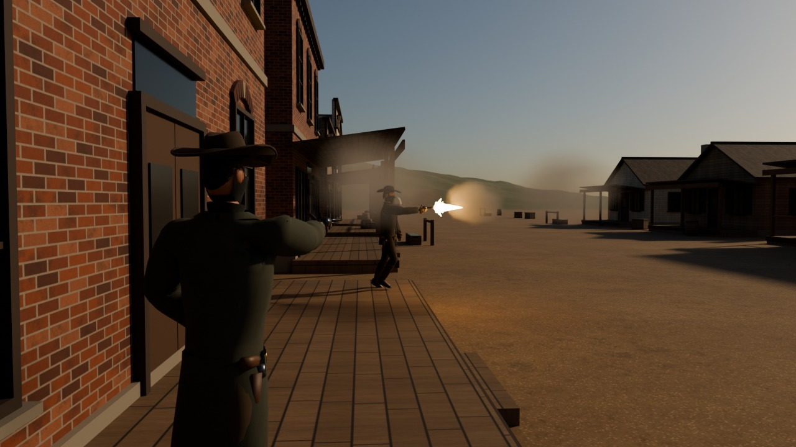
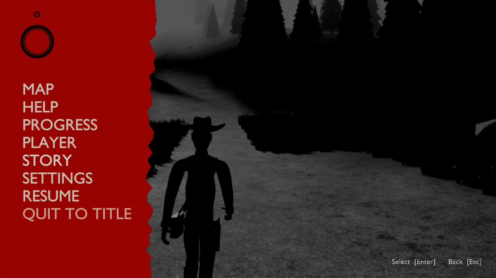
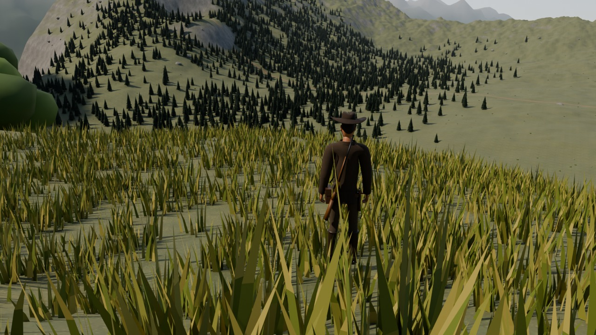
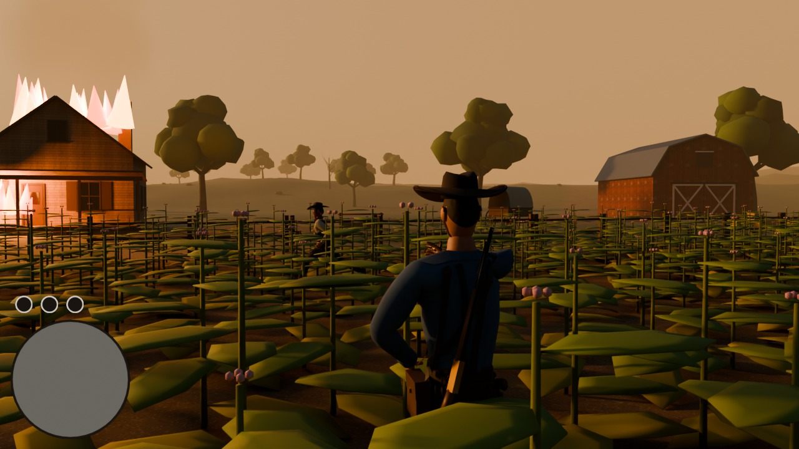
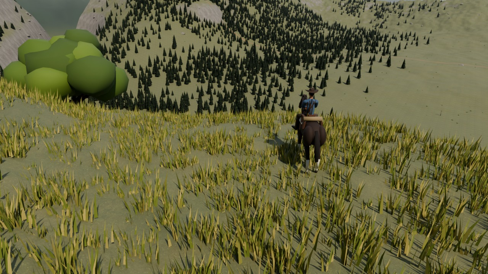

# Outlaw Frontier

An open-world western in the browser, inspired by Red Dead Redemption 2. Ride across a river valley, hunt deer, and take on the masked Lockhart gang over five story missions. Every model, rig, animation, texture and the terrain itself is built by a Blender Python script (`blender/`), and the game runs on [three.js](https://threejs.org).

It's an original homage: none of Rockstar's art, names or logos are used.

| | |
| --- | --- |
|  |  |
|  |  |
|  | These five stills were rendered in Blender (Cycles) by `blender/render_shots.py`, from the same models and terrain the game uses. |

## Play it

- **From your desktop:** save `desktop/outlaw-frontier.html` and double-click it. It's the whole game in one file (about 6 MB) and works offline, except the fonts, which fall back to system fonts.
- **Locally:** serve the repository root, then open `/western/`:

  ```sh
  python3 -m http.server 8000
  # then open http://localhost:8000/western/
  ```

- **On a website:** upload the repository (at least `western/` and `vendor/`) to any static host, such as GitHub Pages, and open `/western/`.

Click **Start**, then click the game to lock the mouse. Progress saves in your browser.

## Controls

| Action | Keys |
| --- | --- |
| Move / steer the horse | W A S D (camera-relative) |
| Run, gallop | Hold Shift |
| Walk slowly | Hold C or Alt |
| Look | Mouse (or drag with a button held if the mouse won't lock) |
| Aim, shoot | Hold right mouse, left click |
| Reload | R |
| Revolver, rifle, holster | 1, 2, 3 (or the mouse wheel) |
| Dead Eye | Q while aiming, click targets to mark them, Q again to fire at all of them |
| Mount, dismount, talk, skin, loot | E |
| Whistle for your horse | H |
| Map | M |
| Pause menu | Esc or P |
| Mute | N |

Phones get an on-screen stick and buttons.

## The story

You're Cole Brennan, riding with Gus Hale's outfit, camped on the west bank of the Dakota River. Mission givers show as yellow letters on the minimap and map; walk up and press E.

1. **Morning Ride** (Gus): mount your horse and ride up to the lookout on the bluff for a view of the valley.
2. **Fresh Meat** (Gus): take your rifle to the meadow below Eagle Ridge, hunt two deer and skin them.
3. **Trouble in Copper Bluff** (Gus): masked outlaws are robbing the brick bank. Drive them off in two waves.
4. **Smoke on the Horizon** (Sheriff Dawes): raiders have set the Hollis farm alight at sunset. Clear the tobacco field and find Eli Hollis.
5. **Dead or Alive** (Sheriff Dawes): clear out the Lockhart hideout in the northern pines and bring down Red Lockhart.

If you die during a mission, it restarts from its last checkpoint. After the last mission the valley is yours to roam.

## What's in the world

- A 2.4 km square valley with a winding river, grassy western hills, a pine forest under snowy northern peaks, and a ring of distant mountains.
- Copper Bluff, with a brick bank, general store and sheriff's office, a saloon, hotel, gunsmith, barber, livery and houses; the Hollis farm with its tobacco field and red barn; your camp with tents, a covered wagon and a campfire; a log cabin hideout.
- About 13,000 trees, rocks and plants, plus grass that grows around you as you move.
- A day and night cycle (24 minutes per day), a horse with gaits and stamina, deer that spook, townsfolk who run from gunfire, and outlaws who flank and shoot back.
- The HUD from the screenshots: health, stamina and Dead Eye rings above a rotating minimap. The pause menu is a red panel with a pocket watch over a frozen black-and-white frame, with Map, Help, Progress, Player, Story and Settings pages.

## The Blender side

`blender/` holds the Python that makes every asset. It runs with Blender 4.5, either installed or as the `bpy` module:

```sh
pip install bpy==4.5.4               # or use: blender -b -P blender/build_assets.py
python blender/build_assets.py       # about 15 s; writes western/assets/
python blender/render_shots.py       # the five Cycles stills, a few minutes each
python blender/render_shots.py farm --samples 32 --size 960x540
```

| File | What it builds |
| --- | --- |
| `characters.py` | The cowboy: skeleton; a body grown from a stick figure with the Skin modifier, then shaped and weighted; a sculpted head with eyes, lids and ears; hands with fingers; hair, beard and bandana layers clipped along smooth edges; fitted clothing (hat, duster, jacket, vest, suspenders, satchel, gun belt, boots); revolver and rifle; and the idle, walk, run, aim, ride, die, kneel and hands-up animations |
| `char_textures.py` | The character texture atlas: cotton, canvas, denim, wool, leather, felt, bandana, hair and skin tiles, and the painted face |
| `animals.py` | The horse (with saddle, blanket, bedroll and bridle) and the deer, from one four-legged rig with walk, trot, gallop, graze and die animations |
| `buildings.py` | Brick and wooden storefronts with signs, the farmhouse, barn, cabin, water tower, tents, wagon, campfire, fences, bridge and props |
| `nature.py` | Pines, oaks, a dead tree, bushes, rocks, rock slabs, tobacco plants and grass clumps |
| `textures.py` | Tileable brick, clapboard, planks, shingles, barn boards, canvas, bark and ground textures |
| `terrain.py` | The heightmap, river, roads, flattened building sites, and where every building, tree and rock goes |
| `worldmesh.py` | The distant mountain ring and the parchment map |
| `build_assets.py` | Runs all of the above and exports `cowboy.glb`, `horse.glb`, `deer.glb`, `props.glb`, `mountains.glb`, `terrain.bin`, `world.json` and `map.jpg` |
| `render_shots.py` | The five stills above |

## The game code

| File | What it does |
| --- | --- |
| `western/js/main.js` | Startup, game loop, pause, death and respawn, saving, settings |
| `western/js/env.js` | Terrain mesh and shader, river, sky, sun, fog, time of day, grass |
| `western/js/world.js` | Places buildings, props and instanced vegetation from `world.json` |
| `western/js/player.js` | Player movement, riding, the third-person camera, shooting, Dead Eye |
| `western/js/animals.js` | Horses and deer |
| `western/js/npc.js` | Outlaws, townsfolk and mission characters |
| `western/js/missions.js` | The five story missions |
| `western/js/hud.js`, `menu.js` | HUD, minimap, pause menu, title screen |
| `western/js/combat.js`, `effects.js`, `audio.js` | Bullets and damage, smoke and fire, synthesised sound |

After changing the game code, rebuild the one-file version with `npm install` then `npm run build:western`.

---

# Missile Run

A browser game. You guide a missile out of a launch hangar, across a test range and a brick town. Fly through hazard gates and the insides of orange lattice towers, and take out tanks. Each round gives you five missiles.

## How the flying works

- The camera orbits the missile, and your mouse (or finger) turns the camera, not the missile.
- The missile always steers toward whatever the crosshair is pointing at, so swing the camera and the missile curves after it.
- Hold **Float** to inflate the life jacket. The engine cuts out, the missile coasts to a hover, and when you let go it relights and flies toward the crosshair again. You get 3 seconds of floating per missile, and orange float rings top it back up.
- Fuel lasts 25 seconds (boosting burns it faster). When it runs out, the nose drops and the missile falls.

Everything is plain HTML, CSS and JavaScript with [three.js](https://threejs.org) (bundled in `vendor/three`). There is no build step and no image or sound files: textures are drawn on canvases and sounds are synthesised with the Web Audio API.

## Play it from your desktop

`desktop/missile-run.html` is the whole game in one file. Save it to your desktop and double-click it; it opens in your browser and runs without a web server. It works offline, except the title fonts, which fall back to system fonts without internet.

After changing the code, rebuild that file with:

```sh
npm install
npm run build:desktop
```

## Run it locally

ES modules don't load from `file://`, so serve the folder:

```sh
python3 -m http.server 8000
# then open http://localhost:8000
```

(`npx http-server` or any other static server works too.)

## Put it on your website

Upload the whole folder as-is (`index.html`, `css/`, `js/`, `vendor/`) to any static host: GitHub Pages, Netlify, Vercel, or your own server. To host it on GitHub Pages from this repo, go to **Settings → Pages**, choose the branch and the `/ (root)` folder, and save.

To embed it in a page you already have:

```html
<iframe src="/missile-run/index.html" style="width:100%;aspect-ratio:16/9;border:0"
        allow="fullscreen; pointer-lock" title="Missile Run"></iframe>
```

## Controls

| Desktop | Phone |
| --- | --- |
| Mouse to aim (the pointer locks after you click Launch) | Drag anywhere to aim |
| Hold click, Shift or Space to boost | Hold the Boost button |
| Hold right-click, F or E to float (life jacket) | Hold the Float button |
| WASD / arrow keys also aim | |
| Esc or P to pause, M to mute | Pause button, top right |

## Scoring

| Action | Points |
| --- | --- |
| Hit a tank | 100 × your streak of consecutive hits |
| Long shot (a hit after flying 600 m) | +50 |
| Fly through a hazard gate | +25 and 2 s of fuel |
| Fly up or down the inside of a lattice tower | +50 |

Four extra missile skins unlock as your best score climbs.

## Customise

`js/config.js` holds the game's name, tagline, flight tuning, scoring, map bounds and skins. For example, change `GAME_TITLE` to rename the game; the second word is shown in the accent colour. In `FLIGHT`, `steer` and `maxTurnRate` set how sharply the missile chases the crosshair, and `cameraDistance` and `crosshairY` set the camera framing.

| File | What it does |
| --- | --- |
| `js/main.js` | Game loop, rounds, camera, HUD |
| `js/world.js` | The map: hangar, test range, town, towers, gates, trees |
| `js/missile.js` | Missile model, skins, flame, life jacket floats |
| `js/targets.js` | Tanks and float-ring pickups |
| `js/effects.js` | Low-poly fire, smoke, debris and speed streaks |
| `js/audio.js` | Synthesised wind, engine and explosion sounds |
| `js/input.js` | Mouse, keyboard and touch input |
| `js/textures.js` | Canvas-drawn textures |
| `js/collision.js` | Simple collision shapes |

three.js is MIT licensed; see `vendor/three/LICENSE`.
