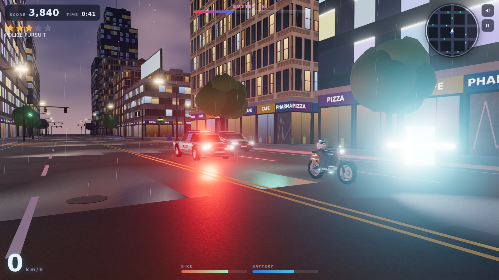

# Night Run



A browser game: you're on a stolen e-bike, it's raining, and the whole city's police force wants a
word. Weave through traffic, slide around corners, boost across intersections, and shake the
cruisers off before they box you in.

Everything is plain HTML, CSS and JavaScript on [three.js](https://threejs.org). All 3D models and
textures are built in **Blender** by the scripts in [`tools/blender`](../tools/blender/README.md);
sound is synthesised with the Web Audio API, so there are no audio or image files.

## Run it

ES modules and glTF loading need a web server (not `file://`). From the repo root:

```sh
python3 -m http.server 8000
# then open http://localhost:8000/ebike/
```

Any static host works. Upload the `ebike/` folder as it is (`index.html`, `css/`, `js/`, `vendor/`, `assets/`).
Add `?q=low` (or `medium`) to the URL, or use the Graphics menu, on slower machines. The game also
drops a preset by itself if the first seconds run below ~28 fps.

## Playing

* **Heat** (stars): 2 to start. Each star brings more, faster cruisers. Staying chased ratchets it
  up every 45 s, and at 3+ stars some cruisers come at you head-on.
* **Shake them:** keep every cruiser more than 150 m away for 8 s and you lose a star. Lose all of
  them to escape.
* **Busted:** cruisers within ~7 m fill the bust meter, faster when you're slow. Wreck the bike
  (walls, poles, cars, rams) and it's over too.
* **Score:** distance, close calls with traffic (combo), batteries, and wrecking cruisers
  (ram them at speed or lure them into walls and traffic).
* **Boost** burns the battery. Cyan battery cells on the roads refill it.

| Keyboard | Touch |
| --- | --- |
| W / ↑ accelerate, S / ↓ brake and reverse | Automatic throttle |
| A D / ← → steer | Hold ◀ ▶ |
| Shift boost | BOOST button |
| Space handbrake drift | DRIFT button |
| C hold to look behind | |
| P / Esc pause, M mute, R restart | Pause button top right |

Gamepad: left stick steer, RT / LT throttle and brake, A boost, X handbrake, Y look back.

## How it's put together

| File | What it does |
| --- | --- |
| `js/main.js` | Renderer (ACES tone mapping, MSAA, bloom), sky and environment map, chase camera, game state, heat and escape rules |
| `js/world.js` | Streams the infinite tiled city around you: builds each 100 m tile from the Blender kit, merges it into a handful of draw calls, and answers collision queries |
| `js/bike.js` | Arcade bike physics: grip, drift, boost, lean, damage, and animating the Blender model's wheels, fork and rider |
| `js/vehicles.js` | Police AI (line-of-sight pursuit, road-grid routing, rubber-banding, rams, bust meter), traffic, and vehicle collisions |
| `js/pickups.js` | Battery cells |
| `js/effects.js` | Sparks, smoke and a GPU rain shader that slants with your speed |
| `js/audio.js` | Synthesised motor whine, wind, rain, Doppler sirens and crashes |
| `js/ui.js`, `css/style.css` | HUD, radar, screens |
| `js/config.js` | All the tuning numbers (bike, cops, heat, traffic, scoring, city layout) |
| `assets/*.glb` | Output of the Blender pipeline. Rebuild with `python tools/blender/build_assets.py` |
| `vendor/` | three.js r186 and the few addons used (glTF loader, bloom, post-processing), MIT licensed |

To rebalance the chase, start with `COP`, `HEAT` and `BIKE` in `js/config.js`.
